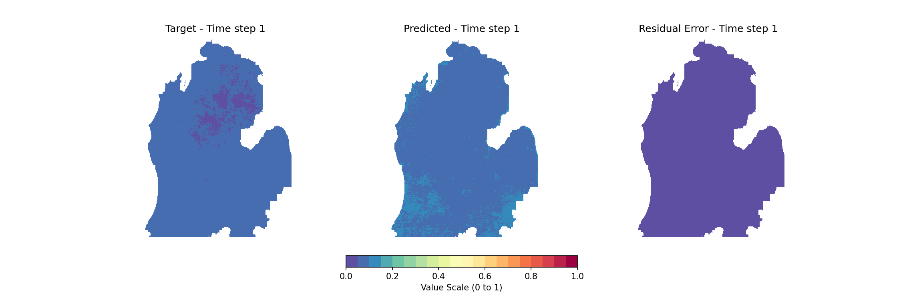

# GeoCNN: Deep Learning Framework for High-Resolution Spatiotemporal Hydrological Modeling

[](LICENSE)
[](https://python.org)
[](https://pytorch.org)

GeoCNN is an advanced deep learning framework for 4D spatiotemporal modeling, purpose-built for environmental and hydrological prediction. The architecture leverages hybrid Convolutional Neural Network (CNN) and Transformer models to achieve high-resolution, four-dimensional (4D) spatiotemporal forecasting—demonstrated at scale for evapotranspiration and groundwater recharge prediction.

## 🎯 Key Features

### 🏗️ Hybrid Architecture
- **U-Net–style encoder-decoder** backbone with skip connections
- **Transformer encoder** for long-range temporal dependencies
- **Deformable convolutions**, Squeeze-and-Excitation (SE) attention, and coordinate attention for spatial awareness
- **Sub-pixel convolution layers** for efficient up-sampling
- **Multi-scale feature extraction** with attention mechanisms

### 🔄 Comprehensive Data Pipeline
- **Multi-modal inputs**: Static, dynamic, and categorical environmental features
- **Multiple dataset support**: SWAT+ and HydroGeoDataset formats
- **Multiprocessing pipeline**: Queue-based data preloading for efficient large-scale training
- **Intelligent sequence chunking**: Handles variable-length temporal sequences
- **Memory-efficient loading**: Supports datasets larger than available RAM

### 📊 Domain-Specific Loss Functions
- **Custom SpatioTemporalLoss**: Emphasizes spatial boundaries, extreme values, and seasonal hydrological patterns
- **Boundary loss**: Enhanced focus on watershed boundaries and critical zones
- **Seasonal weighting**: Adaptive loss based on hydrological seasons
- **Multiple loss options**: Huber, Focal, and Weighted LogCosh losses for different scenarios

### 🚀 Production-Ready Training Infrastructure
- **Modular registry pattern**: Easy model/optimizer/scheduler selection and extension
- **Advanced training features**: Early stopping, gradient clipping, mixed-precision training
- **Robust logging**: Comprehensive metrics tracking and visualization
- **Model versioning**: Reproducible configuration management
- **Multi-GPU support**: Efficient distributed training capabilities

### 📈 Hydrology-Focused Evaluation
- **Domain-specific metrics**: Nash–Sutcliffe Efficiency (NSE), RMSE, MSE for cell-wise and basin-scale validation
- **Automated visualizations**: GIF/MP4 animations for target vs. predicted sequences
- **Correlation analysis**: Pixel-wise and temporal correlation assessment
- **Performance profiling**: Detailed analysis of model predictions across different hydrological regimes

## 🎬 Model Output Visualization



## 🚀 Getting Started

### Prerequisites
- **Python 3.8+**
- **PyTorch >= 1.10**
- **CUDA-capable GPU** (Recommended: >= 24GB VRAM for large-scale training)
- **HDF5** for data storage and loading

### Installation

1. **Clone the repository**:
```bash
git clone https://github.com/VAHIDMSU/GeoCNN.git
cd GeoCNN
```


2. **Install dependencies**:
```bash
pip install -r requirements.txt
```

### Required Packages
```
torch>=1.10.0
torchvision>=0.11.0
numpy>=1.21.0
h5py>=3.1.0
matplotlib>=3.3.0
imageio>=2.9.0
adabelief-pytorch>=0.2.0
transformers>=4.12.0
torchsummary>=1.5.0
```

## 📊 Data Requirements

GeoCNN has the following dataset formats:

### HydroGeoDataset Format
```
HydroGeoDataset.h5
├── dynamic/          # Time-varying features (precipitation, temperature, etc.)
├── static/           # Time-invariant features (elevation, soil properties, etc.)
├── categorical/      # Categorical features (land use, soil type, etc.)
└── target_*/         # Target variables (ET, groundwater recharge, etc.)
```

### SWAT+ Output Format
```
SWATCentral.h5
├── model_1/
│   ├── dynamic/      # Time series data
│   ├── static/       # Static watershed properties
│   ├── categorical/  # Land use classifications
│   └── target_*/     # Hydrological outputs
├── model_2/
└── ...
```

**Note**: Due to size constraints, datasets are not included in this repository. Contact the me for access or prepare your own data in the compatible HDF5 format.

## 🎮 Usage

### Training a Model

1. **Configure your experiment** in `HyperparameterConfig.py` or via command line:

```python
from GeoCNN.HyperparameterConfig import HyperparameterConfig
from GeoCNN.trainer import GeoClassCNN

config = HyperparameterConfig(
    model="CNNTransformerRegressor_v8",
    DataSet="HydroGeoDataset",
    hydrogeodataset_path="/path/to/your/dataset.h5",
    batch_size=36,
    batch_window=64,
    seq_len=80,
    num_training_epochs=300,
    opt_lr=1e-4,
    embed_dim=1024,
    num_heads=8,
    num_layers=6
)

# Initialize and train
trainer = GeoClassCNN(config)
trainer.train_model()
```

2. **Command line training**:
```bash
python -m GeoCNN.pipeline --config_path configs/hydrogeodataset_config.py
```

### Inference and Prediction

```python
from GeoCNN.full_inference import GeoCNNInference

# Load trained model
model_path = "path/to/best_model.pth"
inference = GeoCNNInference(model_path, config)

# Make predictions
predictions = inference.predict(dynamic_data, static_data, categorical_data)

# Evaluate performance
nse, mse, rmse = inference.evaluate(predictions, targets)
```


## 🏗️ Model Architecture

### CNNTransformerRegressor_v8 (Recommended)

The flagship model combines:

- **Encoder Path**: 
  - ConvBlocks with Squeeze-and-Excitation attention
  - Coordinate attention for spatial awareness
  - Progressive downsampling with skip connections

- **Transformer Component**:
  - Temporal multi-head attention
  - Fourier positional encoding
  - Layer normalization and residual connections

- **Decoder Path**:
  - Sub-pixel convolution for upsampling
  - Feature fusion with skip connections
  - Deformable convolutions for adaptive receptive fields

## 📊 Evaluation Metrics

### Hydrological Performance Metrics

- **Nash-Sutcliffe Efficiency (NSE)**: Primary metric for hydrological model evaluation
- **Root Mean Square Error (RMSE)**: Measures prediction accuracy
- **Mean Square Error (MSE)**: Loss function optimization target
- **Correlation Analysis**: Pixel-wise and temporal correlations

### Visualization Tools

- **Animated Predictions**: GIF/MP4 generation for temporal analysis
- **Correlation Plots**: Scatter plots and heat maps
- **Performance Dashboards**: Comprehensive metric visualization
- **Error Analysis**: Spatial and temporal error distribution

## ⚙️ Configuration

### Key Configuration Parameters

```python
@dataclass
class HyperparameterConfig:
    # Model Architecture
    model: str = "CNNTransformerRegressor_v8"
    embed_dim: int = 1024
    num_heads: int = 8
    num_layers: int = 6
    dropout: float = 0.3
    
    # Training Settings
    batch_size: int = 36
    seq_len: int = 80
    num_training_epochs: int = 300
    opt_lr: float = 1e-4
    weight_decay: float = 1e-4
    
    # Data Settings
    DataSet: str = "HydroGeoDataset"
    target_array: str = "recharge"  # or "et", "wateryld"
    
    # Loss Function
    loss_function: str = "SpatioTemporalLoss"
    
    # Optimization
    optimizer: str = "AdaBelief"
    scheduler: str = "CosineAnnealingHardRestarts"
```

## 🔬 Advanced Features

### Custom Loss Functions

The `SpatioTemporalLoss` incorporates:
- **Boundary emphasis**: Higher weights for watershed boundaries
- **Seasonal weighting**: Adaptive loss based on hydrological seasons
- **Outlier handling**: Special treatment for extreme values
- **No-value masking**: Proper handling of missing data

### Multi-Processing Pipeline

- **Queue-based data loading**: Continuous data flow during training
- **Memory management**: Efficient handling of large datasets
- **Process synchronization**: Coordinated data loading and training

### Model Registry System

Easily extensible framework for adding new components:
- Models
- Optimizers  
- Loss functions
- Schedulers
- Feature extractors

## 📈 Performance Benchmarks

### Typical Performance on HydroGeoDataset
- **NSE**: 0.75-0.85 (basin-averaged)
- **RMSE**: 15-25 mm/year (depending on target variable)
- **Training Time**: 1-2 hours on single L40S

### Scalability
- **Dataset Size**: Tested up to 100GB+ HDF5 files
- **Spatial Resolution**: 250m or 30m pixels
- **Temporal Resolution**: Daily to annual predictions

## 🤝 Contributing

We welcome contributions! Please follow these guidelines:

1. **Fork the repository** and create a feature branch
2. **Follow PEP 8** style guidelines
3. **Add tests** for new functionality
4. **Update documentation** as needed
5. **Submit a pull request** with a clear description

## 📄 License

Read the [LICENSE](LICENSE) file for details.
